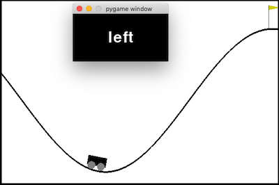

# EEG TAMER 

Getting started:
-	Pull from github: https://github.com/SherbertLemon77/EEG-TAMER
-	Install EMOTIV Launcher and log in with credentials: https://www.emotiv.com/emotiv-launcher/
o	User:  --- see slack file
o	Password: --- see slack file
-	Have headset on and connected while coding (so authentication goes through and EEG stream is running)
-	To run EEG-TAMER system execute ./run.py file from command line

Goal of Code: 
Connect EEG to TAMER to train Mountain Car

Code outline: 
Run Mountain Car Simulation, Run TAMER, authenticate to EEG and get a stream of high performance metrics into a queue, TAMER takes metrics off of this queue and uses them as feedback (multiprocessed)

3 main files of interest: 
run.py		(location: EEG TAMER>)
agent.py	(location: EEG TAMER>tamer)
interface.py	(location: EEG TAMER>tamer)

main modules used: 
	gym
	asyncio
	multiprocessing
	queue
	threading
	numpy
	sklearn
	pygame
	

Status: Pickling Error
“Attribute Error: can’t pickle local object” 
-	Tried different solutions documented inside run.py file at the bottom

TODO1: Fix Pickling Error
	File: run.py		line 40
	Code lines of relevance: 
		Run.py 	line 38 (main())
		Agent.py	line 431 (train())
Comments: error comes up when you run ./run.py
TODO2:  remove unneeded train sections
	File: agent.py		line 423
Comments: 
after pickling is fixed the process will be initiated from either run.py or the agent.py – delete the process and queue initiation from the unneeded section. Make sure to pass q (the queue) into agent.py if that is not where it is initiated
TODO3: change to define reward in terms of queue_entry
	File: interface.py 	line 24
Comments: the reward should be defined in terms of the dictionary entry that is given by queue_entry
		
Tuning: 
o	Start with excitement and stress as a subtracted metric and then change to other metrics depending on result
	Reward = excitement_mag – stress_mag
o	Check that the timestamp of the EEG and TAMER are ligned up (and no backlog in the queue is making a small time offset) 

General Previous Choices and Steps: 
-	From multithreading to multiprocessing because Python GIL Lock caused Mountain Car to halt once the EEG stream began to run and didn’t share the mutex. Multiprocessing avoids this issue. 

#TAMER
TAMER (Training an Agent Manually via Evaluative Reinforcement) is a framework for human-in-the-loop Reinforcement Learning, proposed by [Knox + Stone](http://www.cs.utexas.edu/~sniekum/classes/RLFD-F16/papers/Knox09.pdf) in 2009. 

This is an implementation of a TAMER agent, converted from a standard Q-learning agent using the steps provided by Knox [here](http://www.cs.utexas.edu/users/bradknox/kcap09/Knox_and_Stone,_K-CAP_2009.html).

## How to run
You need python 3.7+ with numpy, sklearn, pygame and gym.

Use run.py. You can fiddle with the config in the script.

In training, watch the agent play and press 'W' to give a positive reward and 'A' to give a negative. The agent's current action is displayed.

# 
